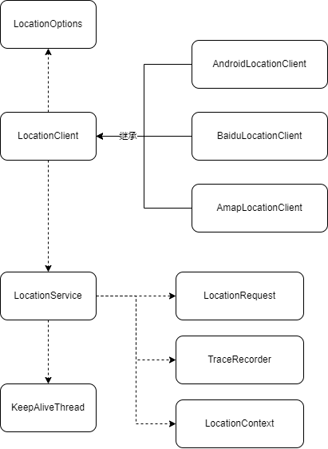

# MagicalLocation

Android positioning library provides real-time location information and trajectory recording functions. Positioning is performed as a background service for continuous positioning and has a background keep-alive solution. Application scenarios:


- Map APP needs to obtain GPS location information or GPS positioning layer in any code location.
- Sports apps need to update current location information and background track records in real time.

The default implementation is Android system positioning. If you need Baidu or Amap to implement it, you can implement `BaseLocationRequest` yourself.



## 集成

```groovy

repositories {
    // 仓库地址
    maven { url 'https://maven.raeblog.com/repository/public/' }
}

dependencies {
    // 引用库
    implementation 'com.github.raedev:location:1.0.0'
}
```

## use

For more calling methods, please see the `MainActivity.kt` example.

```kotlin

// TODO: Please obtain the location permission before calling LocationClient, otherwise all subsequent services will not be available.
val context: Activity = this
LocationPermission.requestPermission(context)

//Initialize location client
val client = LocationClient(context)
client.listener = object : LocationListener {
    override fun onLocationChanged(location: Location) {
        // 位置信息回调（业务处理）
    }
}


// Start monitoring location information
client.start()

// Get the last location information
val location = MagicalLocationManager.getLastLocation(context)


// Stop location monitoring
client.stop()


// Release background service
client.destroy()

```
